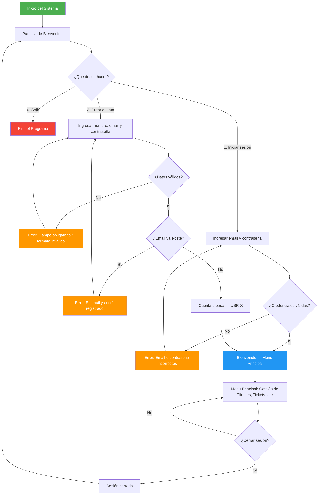
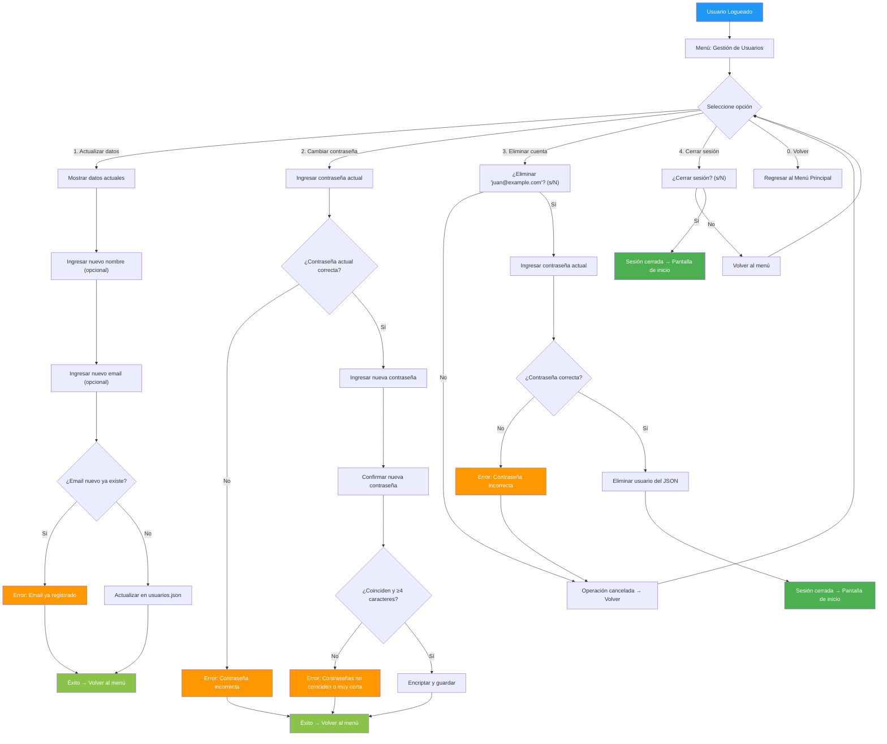
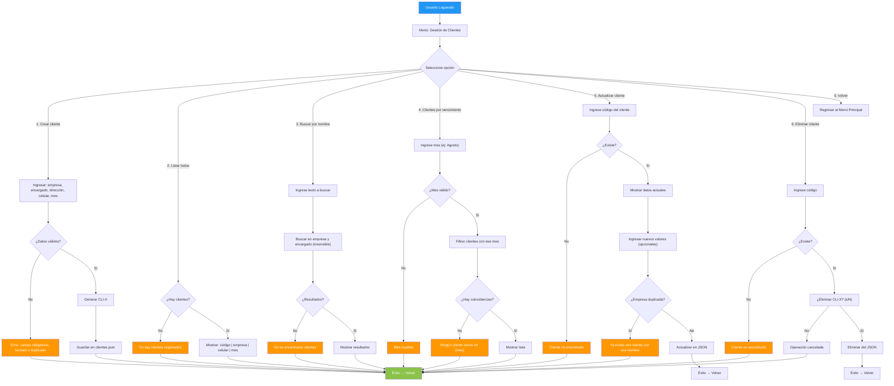
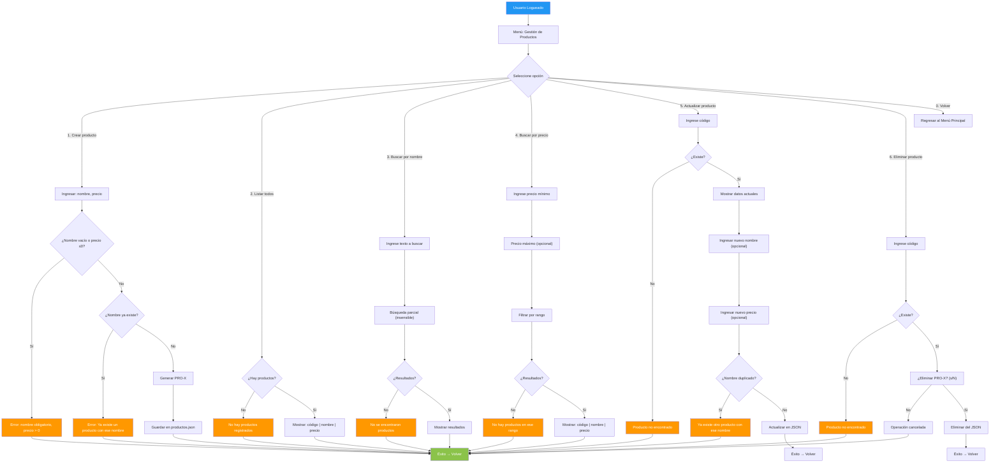
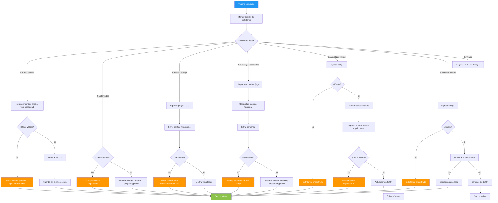
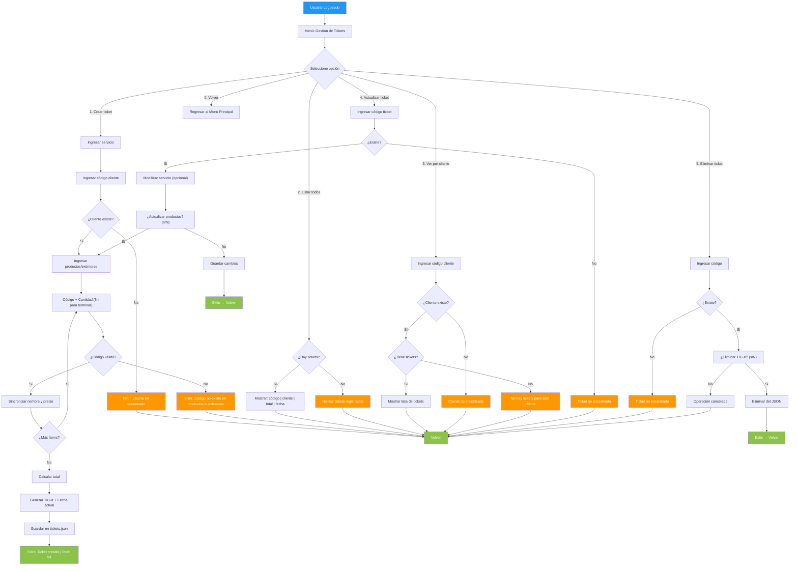
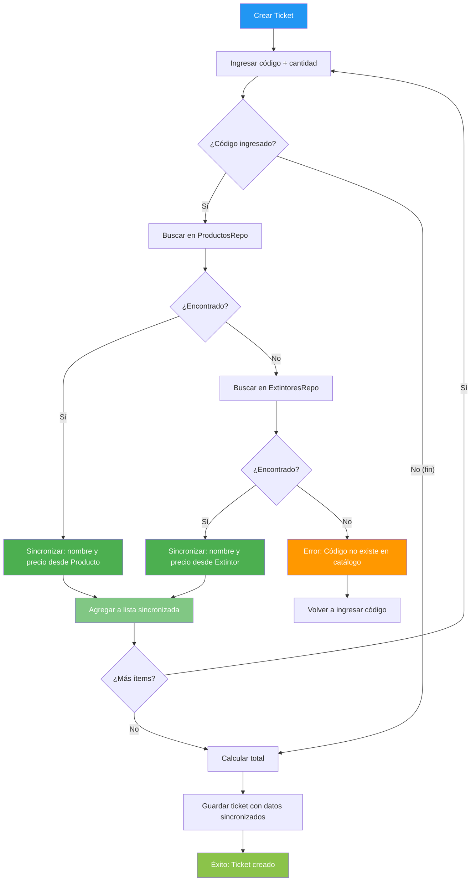
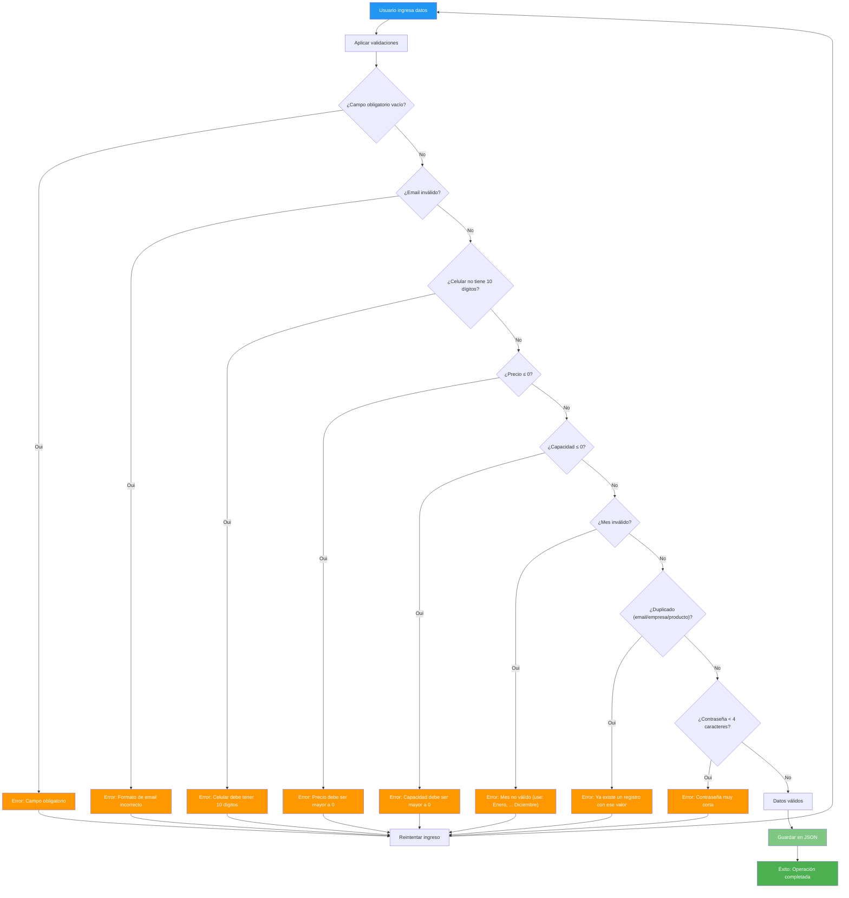
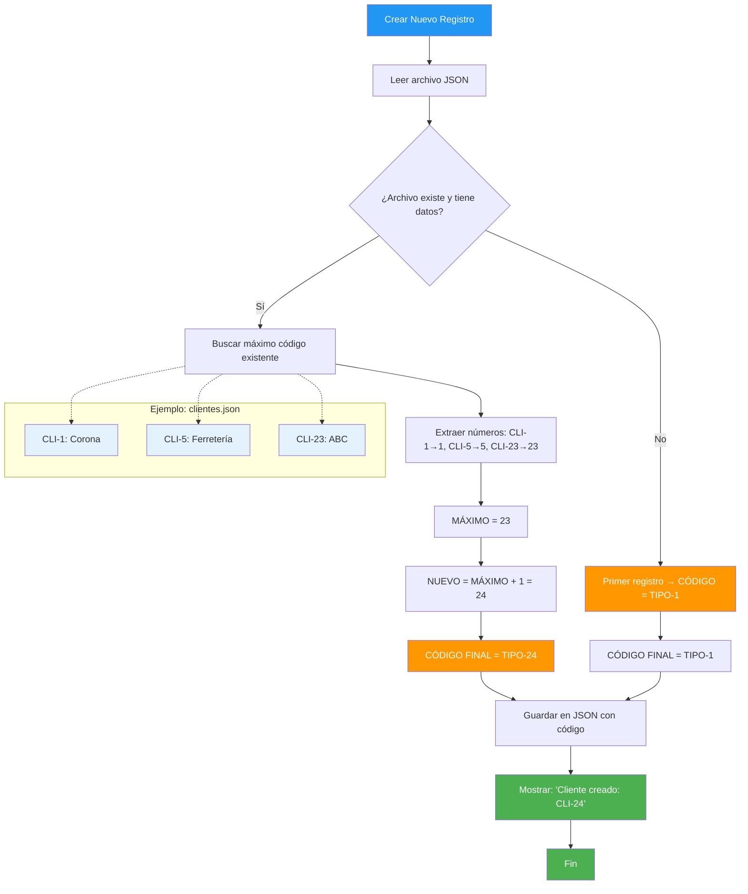
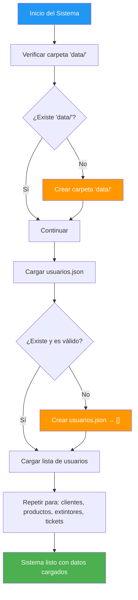

# 🧩 SISTEMA DE GESTIÓN EXTINSIA  
### Mini Proyecto – Sistema de Tickets con Productos y Extintores

---

## 📋 Requerimientos Funcionales

| **ID** | **Requerimiento** |
|:-------|:------------------|
| **RF01** | Autenticación de usuarios – Login y registro obligatorio antes de acceder al sistema |

# 🧩 Autenticación de Usuarios

**Como** usuario del sistema,  
**quiero** registrarme con un perfil único o iniciar sesión con mis credenciales  
**para** acceder de forma segura al sistema de gestión integral y poder realizar operaciones sobre clientes, productos, extintores y tickets.

El acceso al menú principal solo será posible después de una autenticación exitosa.  
Cualquier intento de uso sin estar logueado debe redirigir a la pantalla de inicio de sesión/registro.

---

## ✅ Criterios de Aceptación

1. El sistema muestra una pantalla inicial con las opciones: **Iniciar sesión**, **Crear cuenta** y **Salir**.  
2. Al seleccionar **Crear cuenta**, se solicitan: **nombre completo**, **email** y **contraseña** (mínimo 4 caracteres).  
3. El **email debe ser único** en el sistema. Si ya existe, se muestra: `"El email ya está registrado"`.  
4. La **contraseña se encripta con bcrypt** antes de guardarse. Nunca se almacena en texto plano.  
5. Al crear la cuenta exitosamente, se genera un código automático `USR-X` y el usuario es logueado automáticamente.  
6. Al seleccionar **Iniciar sesión**, se solicitan **email** y **contraseña**.  
7. Si las credenciales son correctas, se muestra `"¡Bienvenido, [Nombre]!"` y se accede al menú principal.  
8. Si las credenciales son incorrectas, se muestra `"Email o contraseña incorrectos"` y se permite reintentar.  
9. No se permite acceder al menú principal (ni a ninguna funcionalidad) sin estar autenticado.  
10. Desde el menú principal, debe existir una opción para **cerrar sesión**, que regresa a la pantalla inicial.  
11. Todos los **mensajes de error** son claros, en español y no exponen información técnica.  
12. El sistema **crea automáticamente** el archivo `data/usuarios.json` si no existe al intentar registrar el primer usuario.

##  📊 Diagrama de flujo

| **RF02** | Gestión de usuarios – Crear, actualizar, cambiar contraseña, eliminar cuenta |

# 🧩 Gestión de Usuarios (CRUD)

**Como** usuario autenticado,  
**quiero** modificar mis datos, contraseña y eliminar mi cuenta,  
**para** mantener mi perfil seguro y actualizado.

---

## ✅ Criterios de Aceptación

1. El menú **"Gestión de Usuarios"** solo es visible si el usuario está logueado.  
2. Se muestra el **nombre** y **email** del usuario actual.  
3. Opciones disponibles: **Actualizar datos**, **Cambiar contraseña**, **Eliminar cuenta**, **Cerrar sesión**.  
4. **Actualizar datos:** permite cambiar nombre y email (el email debe ser único).  
5. **Cambiar contraseña:** valida la contraseña actual, requiere nueva ≥ 4 caracteres y confirmación.  
6. **Eliminar cuenta:** solicita confirmación con “s” + contraseña actual → elimina permanentemente.  
7. **Cerrar sesión:** regresa a la pantalla de inicio de sesión.  
8. Todos los cambios se guardan en `data/usuarios.json`.  
9. Se realiza manejo seguro de errores (archivo vacío, corrupto, etc.).  
10. Todos los mensajes son claros, en español y sin información técnica.  
11. El código de usuario `USR-X` **no cambia nunca**.  
12. Al eliminar un usuario, su **email queda libre** para un nuevo registro.

##  📊 Diagrama de flujo

| **RF03** | Gestión de clientes – CRUD completo con búsqueda por nombre y vencimiento |

# 🧩 Gestión de Clientes

**Como** usuario autenticado (técnico o administrador),  
**quiero** crear, ver, actualizar y eliminar clientes, además de buscarlos por nombre o mes de vencimiento,  
**para** mantener un registro organizado y actualizado de los clientes del servicio.

---

## ✅ Criterios de Aceptación

1. El menú **"Gestión de Clientes"** solo es accesible si el usuario está logueado.  
2. Opciones disponibles: **Crear**, **Listar**, **Buscar por nombre**, **Buscar por vencimiento**, **Actualizar**, **Eliminar**.  
3. **Crear:** valida nombre de empresa (única), nombre del encargado, celular (10 dígitos), dirección y mes válido.  
4. Se genera un código automático `CLI-1`, `CLI-2`, etc.  
5. **Listar:** muestra código, empresa, celular y mes de vencimiento.  
6. **Buscar por nombre:** realiza una búsqueda parcial (insensible a mayúsculas) en empresa o encargado.  
7. **Buscar por vencimiento:** filtra clientes cuyo mes de vencimiento coincide.  
8. **Actualizar:** permite modificar cualquier campo (valida duplicados en el nombre de empresa).  
9. **Eliminar:** solicita confirmación con “s” + código → elimina permanentemente.  
10. Todos los datos se guardan en `data/clientes.json`.  
11. Si el archivo está vacío o no existe, se maneja como `[]` sin error.  
12. Los mensajes del sistema son claros y en español, por ejemplo: `"Cliente creado"`, `"No se encontraron resultados"`, etc.

##  📊 Diagrama de flujo

| **RF04** | Gestión de productos – CRUD con búsqueda por nombre y precio |

# 🧩 Gestión de Productos

**Como** usuario autenticado (técnico o administrador),  
**quiero** crear, ver, actualizar y eliminar productos, además de buscarlos por nombre o rango de precio,  
**para** mantener un catálogo actualizado de los productos disponibles en el sistema.

---

## ✅ Criterios de Aceptación

1. El menú **"Gestión de Productos"** solo es accesible si el usuario está logueado.  
2. Opciones disponibles: **Crear**, **Listar**, **Buscar por nombre**, **Buscar por precio**, **Actualizar**, **Eliminar**.  
3. **Crear:** valida nombre (único) y que el precio sea mayor que 0.  
4. Se genera un código automático `PRO-1`, `PRO-2`, etc.  
5. **Listar:** muestra código, nombre y precio.  
6. **Buscar por nombre:** realiza una búsqueda parcial (insensible a mayúsculas).  
7. **Buscar por precio:** permite filtrar por rango opcional (mínimo y/o máximo).  
8. **Actualizar:** permite modificar nombre (único) y precio.  
9. **Eliminar:** solicita confirmación con “s” + código → elimina permanentemente.  
10. Todos los datos se guardan en `data/productos.json`.  
11. Si el archivo está vacío o no existe, se maneja como `[]` sin error.  
12. Los mensajes del sistema son claros y en español, por ejemplo: `"Producto creado"`, `"No encontrado"`, etc.

##  📊 Diagrama de flujo

| **RF05** | Gestión de extintores – CRUD con búsqueda por tipo y capacidad |

# 🧩 Gestión de Extintores

**Como** usuario autenticado (técnico o administrador),  
**quiero** crear, ver, actualizar y eliminar extintores, además de buscarlos por tipo o rango de capacidad,  
**para** mantener un catálogo organizado de extintores disponibles para venta o servicio.

---

## ✅ Criterios de Aceptación

1. El menú **"Gestión de Extintores"** solo es accesible si el usuario está logueado.  
2. Opciones disponibles: **Crear**, **Listar**, **Buscar por tipo**, **Buscar por capacidad**, **Actualizar**, **Eliminar**.  
3. **Crear:** valida nombre, precio (> 0), tipo (ejemplo: `CO2`, `ABC`), y capacidad (> 0).  
4. Se genera un código automático `EXT-1`, `EXT-2`, etc.  
5. **Listar:** muestra código, nombre, tipo, capacidad y precio.  
6. **Buscar por tipo:** aplica un filtro exacto (insensible a mayúsculas).  
7. **Buscar por capacidad:** permite buscar por rango opcional (mínimo y/o máximo).  
8. **Actualizar:** permite modificar cualquier campo del extintor.  
9. **Eliminar:** solicita confirmación con “s” + código → elimina permanentemente.  
10. Todos los datos se guardan en `data/extintores.json`.  
11. Si el archivo está vacío o no existe, se maneja como `[]` sin error.  
12. Los mensajes del sistema son claros y en español, por ejemplo: `"Extintor creado"`, `"No encontrado"`, etc.

##  📊 Diagrama de flujo

| **RF06** | Gestión de tickets – Crear ticket con productos y extintores, listar, filtrar por cliente |

# 🧩 Gestión de Tickets

**Como** técnico autenticado,  
**quiero** crear tickets que incluyan productos y extintores, ver todos los tickets y filtrarlos por cliente,  
**para** registrar servicios realizados y tener trazabilidad de ventas por cliente.

---

## ✅ Criterios de Aceptación

1. El menú **"Gestión de Tickets"** solo es accesible si el usuario está logueado.  
2. Opciones disponibles: **Crear**, **Listar todos**, **Ver por cliente**, **Actualizar**, **Eliminar**.  
3. **Crear:** solicita servicio, código de cliente y lista de productos/extintores (código + cantidad).  
4. Se valida que el cliente, los productos y los extintores existan antes de guardar.  
5. Sincroniza nombre y precio desde `ProductosRepo` o `ExtintoresRepo`.  
6. Se genera un código automático `TIC-1`, `TIC-2`, etc.  
7. Calcula el **total = Σ(precio × cantidad)**.  
8. Guarda la **fecha actual** en formato `YYYY-MM-DD`.  
9. **Listar todos:** muestra código, cliente, total y fecha.  
10. **Filtrar por cliente:** muestra todos los tickets correspondientes a un código de cliente.  
11. **Actualizar:** permite modificar el servicio o la lista de productos/extintores.  
12. **Eliminar:** solicita confirmación con “s” + código → elimina permanentemente.  
13. Todos los datos se guardan en `data/tickets.json`.  
14. Los mensajes del sistema son claros y en español, por ejemplo: `"Ticket creado: TIC-5"`.

##  📊 Diagrama de flujo

| **RF07** | Sincronización de catálogo – Precio y nombre de productos/extintores se toman del catálogo al crear ticket |

# 🧩 Sincronización de Catálogo en Tickets

**Como** técnico,  
**quiero** que al crear un ticket, los productos y extintores se sincronicen automáticamente con el catálogo,  
**para** garantizar que el nombre y precio del ticket sean siempre correctos y actualizados.

---

## ✅ Criterios de Aceptación

1. Al crear un ticket, se solicita el **código** y la **cantidad** de cada ítem.  
2. El sistema busca primero en `ProductosRepo` por el código proporcionado.  
3. Si no lo encuentra, busca en `ExtintoresRepo`.  
4. Si el ítem existe en cualquiera de los dos repositorios, se **sincroniza automáticamente** su nombre y precio con el catálogo actual.

##  📊 Diagrama de flujo

| **RF08** | Validación de datos – Campos obligatorios, formatos, duplicados |

# 🧩 Validación de Datos en Todo el Sistema

**Como** usuario del sistema,  
**quiero** que todos los datos ingresados sean validados automáticamente,  
**para** evitar errores, inconsistencias y datos corruptos en el sistema.

---

## ✅ Criterios de Aceptación

1. Los **campos obligatorios** no pueden estar vacíos (por ejemplo: nombre, email, empresa, etc.).  
2. El **email** debe tener un formato válido (`usuario@dominio.com`).  
3. El **celular** debe contener exactamente **10 dígitos numéricos**.  
4. El **precio** debe ser un **número positivo** (> 0).  
5. La **capacidad** también debe ser un **número positivo** (> 0).  
6. El **mes de vencimiento** debe corresponder a uno de los **12 meses válidos** del año.

##  📊 Diagrama de flujo

| **RF09** | Códigos únicos automáticos – `USR-1`, `CLI-1`, `PRO-1`, `EXT-1`, `TIC-1` |

# 🧩 Generación Automática de Códigos Únicos

**Como** usuario del sistema,  
**quiero** que todos los registros tengan un código único generado automáticamente,  
**para** identificar fácilmente cada registro sin intervención manual ni riesgo de duplicados.

---

## ✅ Criterios de Aceptación

1. El **formato** del código debe seguir la estructura `TIPO-NÚMERO` (por ejemplo: `USR-1`, `CLI-5`, `PRO-23`).  
2. Cada entidad tiene un **prefijo único**:  
   - `USR-` → Usuarios  
   - `CLI-` → Clientes  
   - `PRO-` → Productos  
   - `EXT-` → Extintores  
   - `TIC-` → Tickets  
3. La generación del código es **automática**: el usuario **no puede ingresarlo manualmente**.  
4. El número es **incremental**, asignando siempre el **siguiente número disponible**.  
5. Los códigos son **persistentes**, conservándose incluso tras reiniciar el sistema.  
6. Cada código es **inmutable**, no se modifica al actualizar un registro.  
7. Los códigos son **únicos globalmente**, sin posibilidad de duplicados entre registros.  
8. El código se genera **antes de guardar** el registro en el archivo JSON.  
9. Si el archivo está vacío, la numeración **comienza desde 1**.  
10. Al crear un registro, el sistema muestra un mensaje como: `"Cliente creado: CLI-1"`.

##  📊 Diagrama de flujo

| **RF10** | Persistencia en JSON – Todos los datos se guardan en archivos `data/*.json` |

# 🧩 Persistencia de Datos en Archivos JSON

**Como** administrador del sistema,  
**quiero** que todos los datos (usuarios, clientes, productos, extintores, tickets) se guarden en archivos JSON,  
**para** garantizar que la información persista entre sesiones y sea fácil de respaldar.

---

## ✅ Criterios de Aceptación

1. Todos los datos se guardan en la carpeta `data/`.  
2. Archivos por entidad:  
   - `data/usuarios.json`  
   - `data/clientes.json`  
   - `data/productos.json`  
   - `data/extintores.json`  
   - `data/tickets.json`  
3. Si la carpeta `data/` no existe, el sistema la **crea automáticamente**.  
4. Si el archivo JSON no existe, se crea con una lista vacía `[]`.  
5. Si el archivo está corrupto, se trata como **vacío (`[]`)** sin que el programa falle.  
6. El formato de los archivos es **JSON válido**, con `indent=4`, `UTF-8`, y `ensure_ascii=False`.  
7. Las operaciones de lectura/escritura manejan **errores seguros**: `FileNotFoundError`, `JSONDecodeError`, etc.  
8. Los archivos **no deben editarse manualmente**; solo el sistema escribe en ellos.  
9. Los datos guardados deben incluir **todos los campos definidos en el modelo** correspondiente.  
10. Al iniciar el programa, los datos se **cargan desde los archivos JSON**.  
11. Al cerrar o modificar información, los cambios se **guardan inmediatamente**.  
12. El respaldo del sistema se realiza fácilmente copiando la carpeta `data/` com

##  📊 Diagrama de flujo

